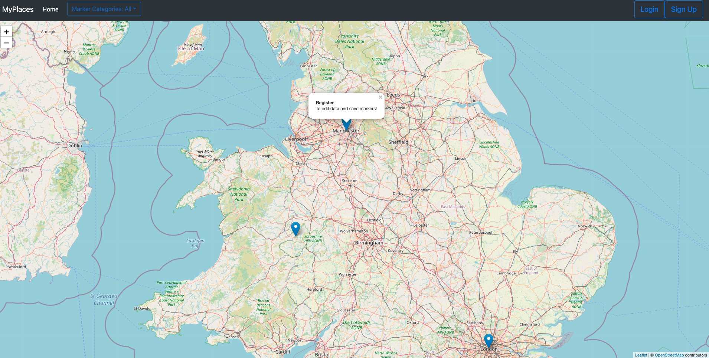
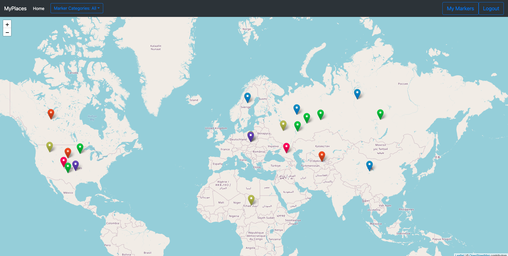
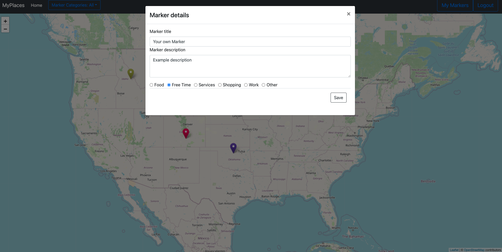
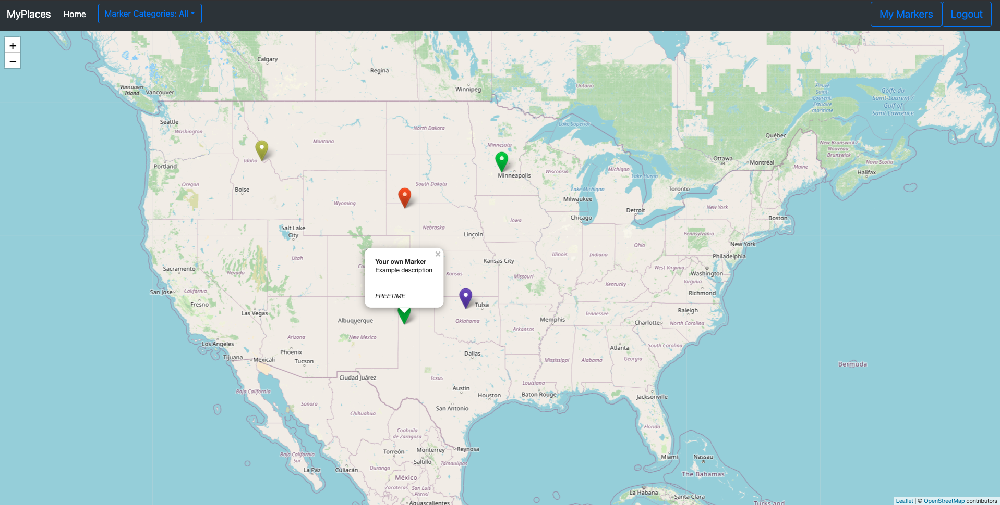
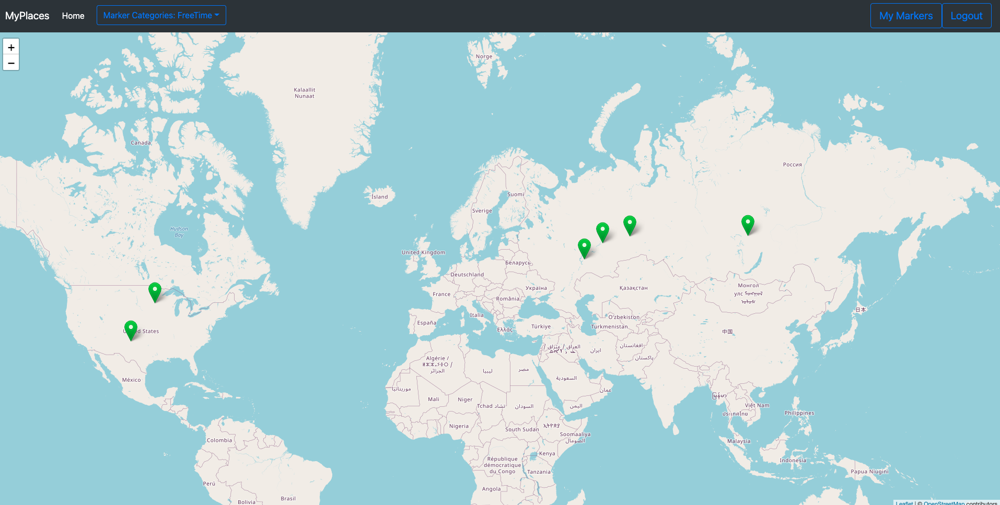
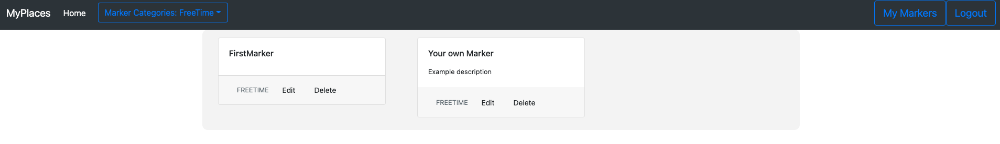

# MyPlaces

A full-stack web application created with Spring and Angular.
Provides world map to user and allows him to create markers with title, description and category.

#### Live demo: [https://myplaces-spring-angular.herokuapp.com](https://myplaces-spring-angular.herokuapp.com)

## Features

  - Allows user to create his account.
  - User can create new markers on map, edit markers' details and remove markers.
  - Spring Security provides password encoding, authorization and authentication.
  - Database stores data about users and markers.

#### Site before login

#### All user markers

#### Creating new marker

#### Displaying details

#### Markers with selected category

#### Marker list

### Technologies

Project is created with:
* Java 15
* Spring boot 2.3.2
* Spring Data 
* Spring Security
* Angular 9
* Angular CLI
* Leaflet
* OpenStreetMap
* Mockito
* Bootstrap
* Maven
* Heroku
* PostgreSQL on production mode
* H2Database on development mode
* Hibernate
* REST
* Lombok
